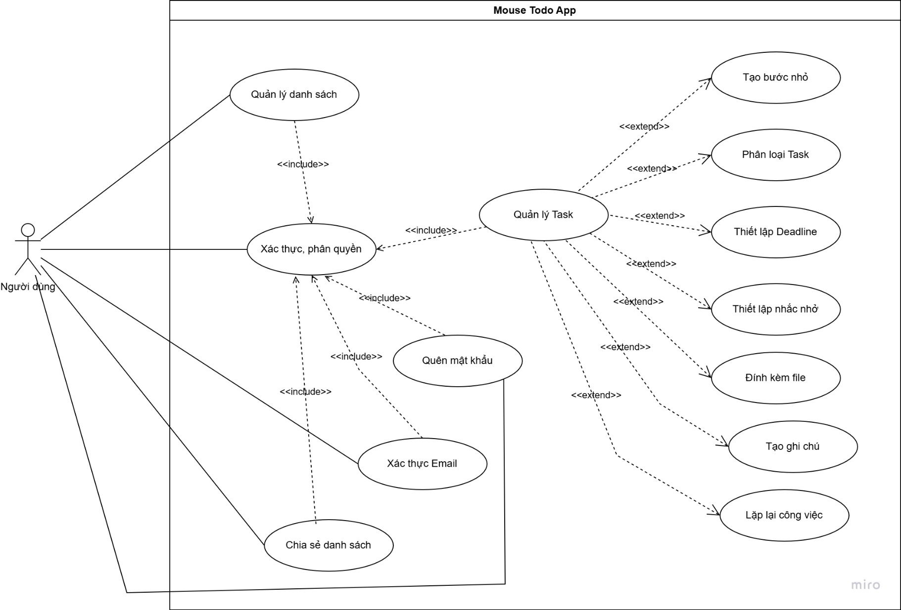
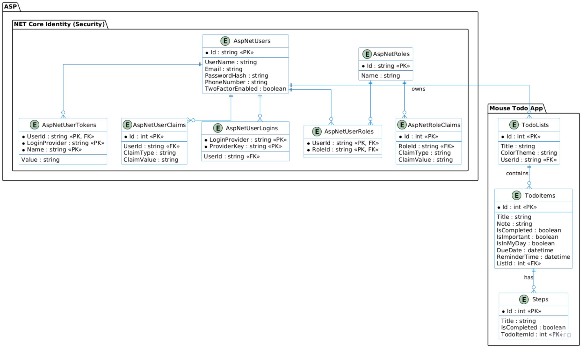

# 🐭 MouseTodoApp (v1.0.0-alpha)

MouseTodoApp là một ứng dụng quản lý công việc (Todo App) toàn diện, được xây dựng nhằm mục đích theo dõi và sắp xếp các tác vụ hàng ngày một cách hiệu quả. Dự án này được phát triển như một ví dụ thực tế để học tập thêm về việc áp dụng các pattern, kiến trúc phần mềm hiện đại và các kỹ năng sử dụng framework (React, .NET).

---

## 👥 Thành viên nhóm phát triển (Link Github cập nhật sau)

- **Lê Hoàng Nhi** - [GitHub Profile](https://github.com/usernameA)
- **Trần Trọng Phúc** - [GitHub Profile](https://github.com/usernameB)
- **Nguyễn Phước Lộc** - [GitHub Profile](https://github.com/usernameC)
- **Nguyễn Ngọc Đức Phát** - [GitHub Profile](https://github.com/usernameD)

---

## 🚀 Công nghệ sử dụng

Dự án được xây dựng dựa trên sự kết hợp giữa hệ sinh thái React (Frontend) và .NET (Backend):

### Frontend

- **Core:** React (khởi tạo qua Vite)
- **Ngôn ngữ:** TypeScript
- **Thư viện** Tailwind CSS (v4.2), Prettier, Eslint, Fontsource (Open Sans)
- _(Các thư viện UI, State management, Fetching data sẽ được bổ sung sau...)_

### Backend

- **Core:** .NET 10 (ASP.NET Core Web API)
- **Ngôn ngữ:** C# 12+
- _(Database, ORM, Logging sẽ được bổ sung sau...)_

---

## 🏗 Kiến trúc phần mềm

Đối với Backend áp dụng **Clean Architecture** (dựa trên Ports & Adapters / Hexagonal Architecture). Kiến trúc này giúp tách biệt hoàn toàn Business Logic khỏi các chi tiết kỹ thuật (Database, Frameworks, UI), đảm bảo tính dễ bảo trì và mở rộng. Lưu ý: kiến trúc này được đút kết và học hỏi từ nhiều nguồn khác nhau, mang tính chất tham khảo.

Đối với Frontend áp dụng **Component-based architecture**, nơi mỗi thành phần giao diện được xem như một khối độc lập, dễ tái sử dụng và quản lý.

Dự án được chia thành 4 lớp (Layers) chính:

1. **Domain:** Chứa các Entities cốt lõi (Ví dụ: `TodoItem`).
2. **Application:** Chứa Use Cases và định nghĩa các Interfaces (Ports).
3. **Adapters:** Triển khai các Ports (Ví dụ: Repository giao tiếp DB).
4. **WebAPI:** Điểm đầu vào của ứng dụng (Controllers/Minimal APIs), cấu hình DI.

---

## 📊 Thiết kế hệ thống

### 1. Sơ đồ Usecase (Usecase Diagram) - v1.0.0



### 2. Sơ đồ dữ liệu khái niệm (CDM - Conceptual Data Model) - v1.0.0



---

## 📁 Cấu trúc thư mục chính - Bổ sung sau

```text
/MouseTodoApp
├── /frontend                 # Source code React (Vite)
│   └── package.json
│
└── /backend                  # Source code .NET
    ├── MouseTodoApp.sln
    ├── /MouseTodoApp.Domain
    ├── /MouseTodoApp.Application
    ├── /MouseTodoApp.Adapters
    └── /MouseTodoApp.WebAPI
```
